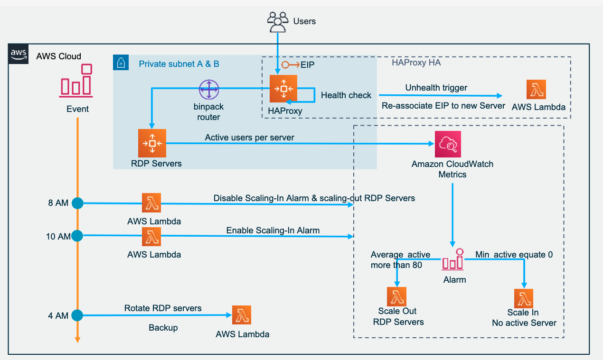

It is a project that help to build the aws insfra for XXX. 
This project use python generate the AWS Cloudformation that contains:

## VPC

vpc.py
securitygroup.py

## AutoScaling, contains Product pool, CloudWatch Metrics, CloudWatch Alarms and Notification

/erp/src/awsAppServerAutoScaling.py
/erp/src/awsHAPROServerAutoScaling.py
/erp/src/awsHASMServerAutoScaling.py
/erp/src/awsHAUEServerAutoScaling.py
/erp/src/awsProRdpServerAutoScaling.py
/erp/src/awsSMRdpServerAutoScaling.py
/erp/src/awsUERdpServerAutoScaling.py
/erp/src/awsWebServerAutoScaling.py

## Lambda, 

AppServer, HAProxyAutoScaling, RdpProductAutoScaling, CloudWatch Metrics to monitor app cluster and trigger Lambda to auto maintain the cluster.

/erp/src/kis-new-scaling-out-for-auto-scaling.py
/erp/src/kis_start_replica_app_servers.py
/erp/src/kis_stop_free_replica_app_server.py
/erp/src/kis_stop_replica_app_servers.py

/erp/src/lambda/ebs-create-snapshots.py
/erp/src/lambda/event-scalingIn.json
/erp/src/lambda/kis-HAProxy-EIP.py
/erp/src/lambda/kis-Unhealthy.py
/erp/src/lambda/kis-disable-scale-in-at-8AM.py
/erp/src/lambda/kis-enable-scalingInAt10Am.py
/erp/src/lambda/kis-new-scaling-in-for-auto-scaling.py

## Use below command to install dependency.

pip3 install -r requirements.txt

## Useful commands

 * `make all`             generate AWS CloudFormation resource 
 * `make clean`                clean resouce 

## Output

 * `/erp/templates/01.infrastucture.template`     AWS CloudFormation for Infrastucture
 * `/erp/templates/02.application.template`       AWS CloudFormation for Application

